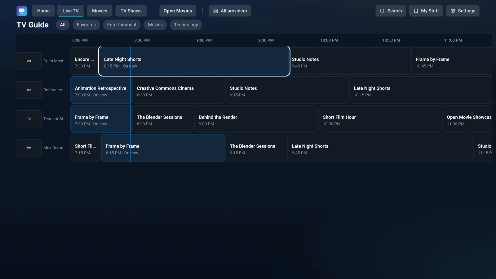
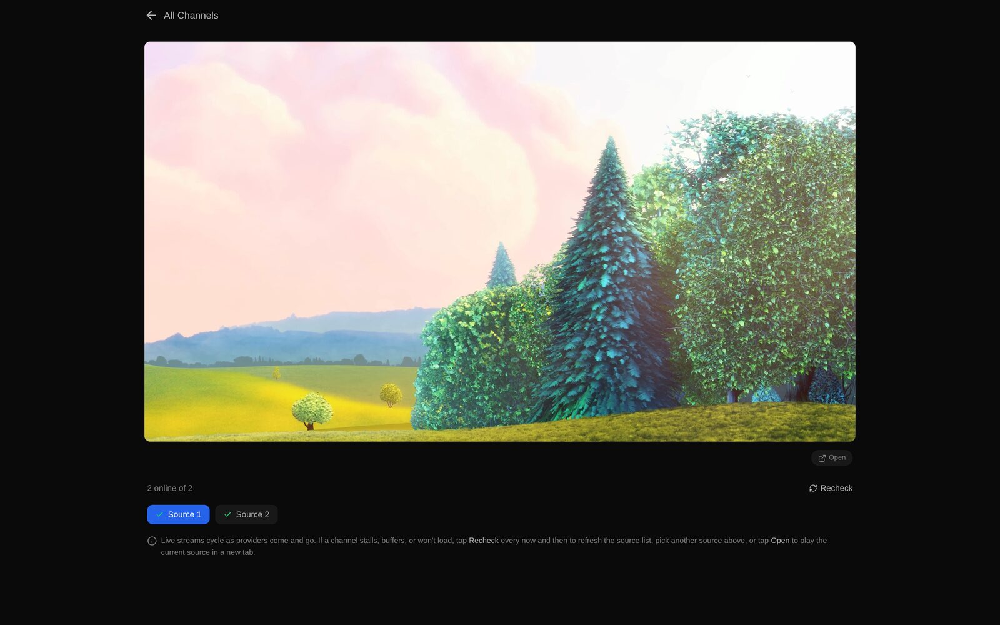
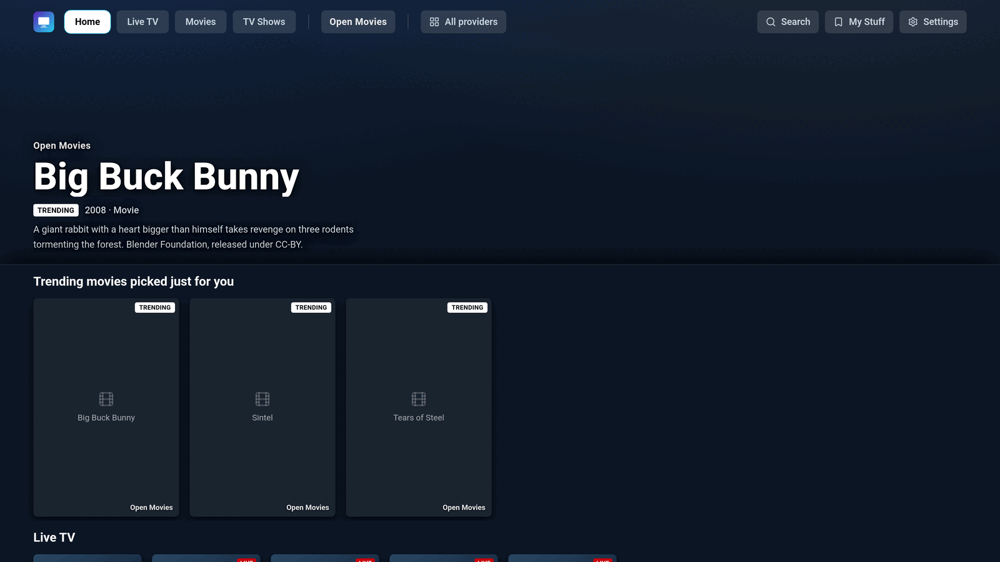
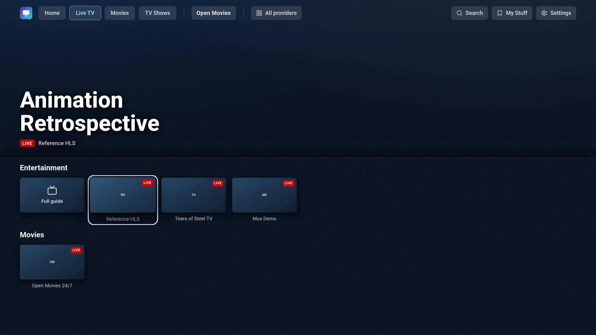
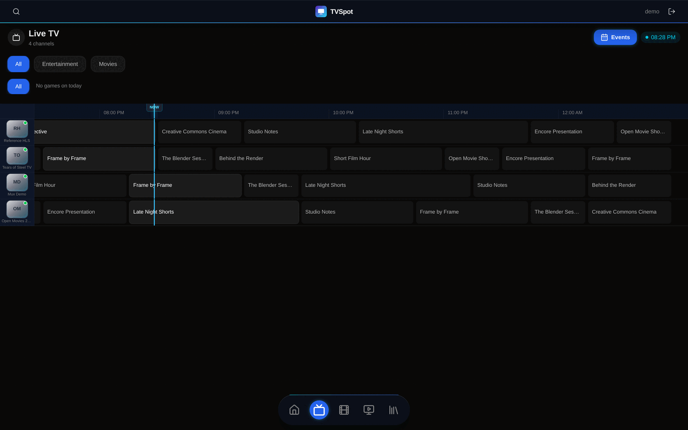
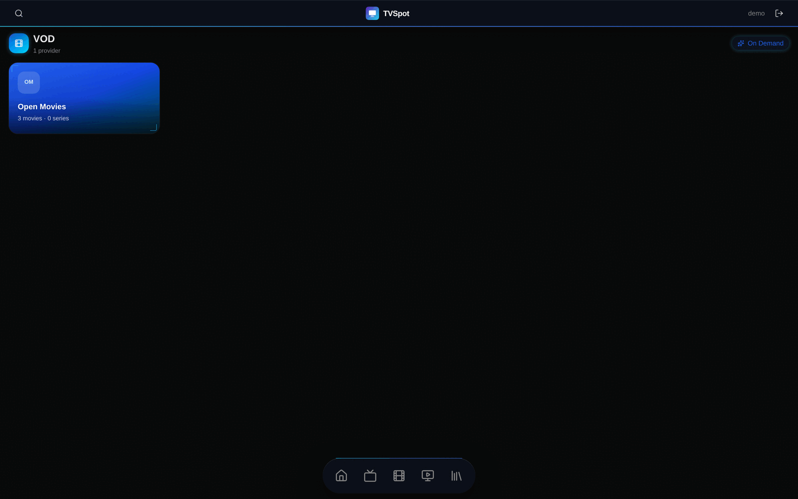
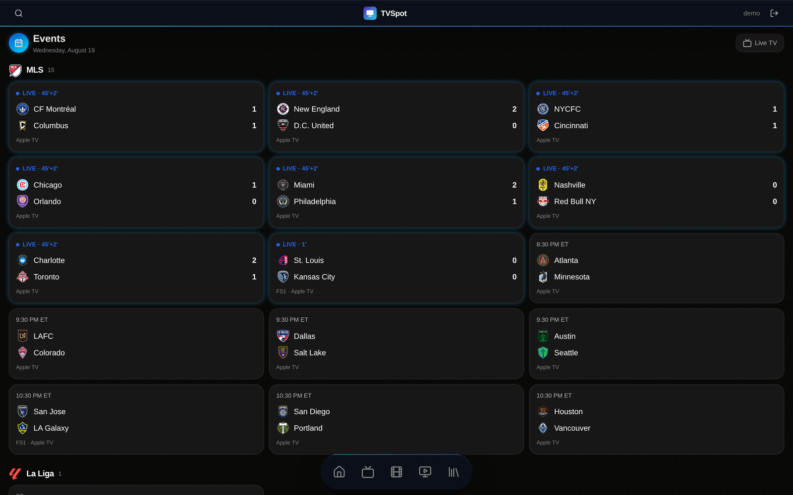
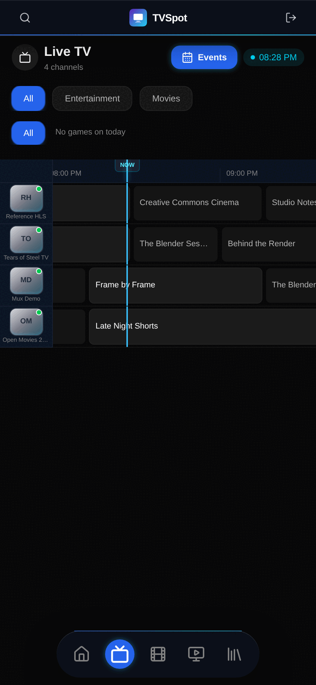
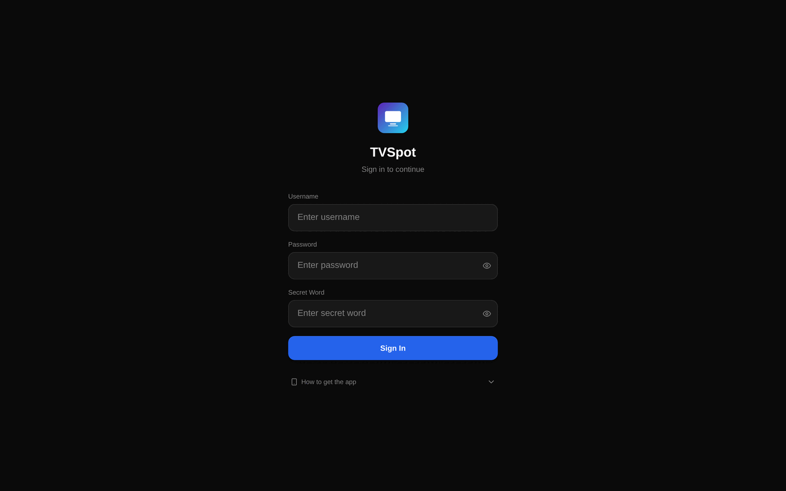

# TVSpot

A streaming front-end with two complete user interfaces sharing one codebase: a
mobile-first web app, and a **10-foot TV interface driven entirely by a D-pad
remote** — packaged for Fire TV and Tizen.

It plays live channels with automatic source failover, an on-demand catalogue,
a scrolling TV guide, and a live sports events board. It runs out of the box
with no accounts, no API keys and no backend service.

```bash
git clone <this repo> && cd tvspot
npm install && npm run demo:data
cp .env.example .env.local
npm run dev            # → http://localhost:3000   sign in: demo / demo / demo
```

<p align="center">
  
  
</p>

---

## Table of contents

1. [What this is](#1-what-this-is)
2. [Screenshots](#2-screenshots)
3. [Running it](#3-running-it)
4. [Configuration](#4-configuration)
5. [Architecture](#5-architecture)
6. [Live playback: how a channel actually plays](#6-live-playback-how-a-channel-actually-plays)
7. [The link-freshness pipeline](#7-the-link-freshness-pipeline)
8. [The TV interface](#8-the-tv-interface)
9. [Packaging: Fire TV, Tizen, PWA](#9-packaging-fire-tv-tizen-pwa)
10. [Project layout](#10-project-layout)
11. [Development](#11-development)
12. [Engineering notes](#12-engineering-notes)
13. [License](#13-license)

---

## 1. What this is

TVSpot is a Next.js 16 / React 19 application that presents a streaming service
across two very different input models:

- **Touch and mouse** — a mobile-first web UI with rails, a bottom nav, a
  floating player and an events board.
- **A remote control** — a separate 10-foot interface under `/tv`, with spatial
  D-pad navigation, a focus model, key hints, and a scrolling guide grid. It is
  not a responsive breakpoint of the phone UI; it is its own set of routes and
  components built for a viewer three metres away holding five buttons.

The interesting engineering is not the grid of posters. It is everything that
happens when a stream does not work:

- every channel carries several sources, and the player **probes them
  server-side before committing to one**, so a dead "Source 1" never leaves a
  black screen;
- sources are **ranked by measured behaviour** — latency, playlist depth, and
  what actually happened last time the source was played — not by their position
  in a list;
- a nightly pipeline **re-verifies every known link**, drops what died, promotes
  replacements from a reserve bench, and refuses to overwrite good data with the
  results of a bad run.

### This is a public demo build

The upstream project is private and runs against its own catalogue service. This
repository is a self-contained build of the same application with the content
layer replaced by **openly-licensed and public test media**:

| | |
| --- | --- |
| On-demand titles | Blender Foundation open movies — *Big Buck Bunny*, *Sintel*, *Tears of Steel* (CC-BY) |
| Live channels | Mux public HLS test streams, Apple's HLS reference stream, W3C sample media |
| Sports events | ESPN's public scoreboard API (no key required) |

Everything that reads content goes through a boundary you can repoint at your
own service — see [Configuration](#4-configuration). No credentials, private
endpoints or third-party catalogues are bundled here, and none are required.

---

## 2. Screenshots

**The 10-foot TV interface** — D-pad navigable, authored at a fixed 1920px
layout viewport.

| Home | Live TV |
| --- | --- |
|  |  |

The guide is a real time-grid: programmes are laid out against a timeline with a
"now" marker, and the D-pad moves between them geometrically.


**The web UI.**

| Live TV | On demand | Events |
| --- | --- | --- |
|  |  |  |

**The player**, showing the per-source health readout — each source probed, the
working ones kept, the first healthy one auto-played.


| Mobile | Sign-in |
| --- | --- |
|  |  |

---

## 3. Running it

Requires Node 20+.

```bash
npm install
npm run demo:data          # generate data/ from scripts/make-demo-data.mjs
cp .env.example .env.local
npm run dev
```

Open <http://localhost:3000> and sign in with **`demo` / `demo` / `demo`**
(username, password, secret word). Change them in `.env.local` — see below.

The TV interface is at **`/tv`**. It is reachable in a normal browser: arrow
keys act as the D-pad and Enter as OK, so you can drive the whole thing from a
desktop keyboard.

```bash
npm run build && npm start   # production build
npm run typecheck            # tsc --noEmit
npm run lint
npm run refresh-links        # run the link-freshness pipeline
```

> **A note on the demo streams.** They are third-party public test streams, so
> some will eventually go away. That is the situation the whole application is
> designed around rather than a flaw in it: `npm run refresh-links` will re-test
> them, drop what has died, and keep what still plays.

---

## 4. Configuration

Everything lives in `.env.local`. See [`.env.example`](.env.example) for the
annotated list; the essentials:

| Variable | Purpose |
| --- | --- |
| `AUTH_USERS` | JSON array of accounts. Ships with a `demo` account — **change it.** |
| `JWT_SECRET` | Signs session cookies and stream tokens. `openssl rand -base64 32` |
| `BACKEND_API_URL` | Your catalogue/metadata service. **Unset ⇒ the bundled demo catalogue is served.** |
| `TMDB_ACCESS_TOKEN` | Artwork only. Without it the UI uses text cards; nothing breaks. |
| `CATALOG_URL` | Where the pipeline gets its channel list. Unset ⇒ `data/channels.json`. |
| `PLAYLIST_URLS` | Extra playlists for the pipeline to ingest. Empty by default. |

**`JWT_SECRET` is enforced in production.** In development an unset secret falls
back to a fixed dev value so a fresh clone runs with no setup. In production
that same fallback would mean every deployment of this code shared one
publicly-known signing key, so the app refuses to sign tokens instead
(`lib/auth.ts:signingSecret`). A missing secret is reported as a configuration
error, not as a failed login — the distinction matters when you are the one
reading the logs.

### Pointing it at your own content

`BACKEND_API_URL` is the single switch. Unset, the app serves
`data/channels.json`, `data/vod-catalog.json` and `data/verified-sources.json`
from disk. Set, three routes shadow the generic proxy and forward upstream
instead — `live-channels`, `epg`, `vod/catalog` — while everything else proxies
through `app/api/lounge/[...path]`. No component knows the difference.

---

## 5. Architecture

```
                      ┌──────────────────────────────┐
   remote / D-pad ───▶│  /tv/*      10-foot UI       │
                      ├──────────────────────────────┤ ── shared hooks, lib/,
   touch / mouse ────▶│  /(main)/*  web UI           │    player, auth, types
                      └───────────────┬──────────────┘
                                      │
                      ┌───────────────▼──────────────┐
                      │  Next route handlers         │
                      │  /api/lounge/*  catalogue    │──▶ your service, or the
                      │  /api/stream-*  probe/proxy  │    bundled demo data
                      │  /api/vod-*     resolve      │
                      │  /api/events    ESPN         │
                      └───────────────┬──────────────┘
                                      │ reads
                      ┌───────────────▼──────────────┐
                      │  data/verified-sources.json  │◀── scripts/link-freshness
                      │  data/vod-index.json         │    (nightly)
                      └──────────────────────────────┘
```

Three deliberate boundaries:

**Server-side stream probing.** Browsers cannot check a cross-origin stream —
CORS makes the result unreadable and a failure indistinguishable from a block.
So `/api/stream-check` does it server-side and returns a verdict per URL.

**Server-only link data.** `lib/linkData.ts` is marked `server-only`, which makes
importing it from a client component a *build* error. That guard exists because
the link data was once imported at module scope, landed in a client chunk, and
every nightly data refresh changed a chunk hash — which changed the build id,
which made every open phone and TV hard-reload, every night, to receive data the
browser never needed. `scripts/link-data-guard.mjs` re-checks the built output on
every `npm run build`.

**One catalogue shape, two sources.** `lib/demoCatalog.ts` and the upstream proxy
return the same shape. The demo path is not a stub or a mock; it is a second
implementation of the same contract, which is why the UI has no idea which one is
running.

---

## 6. Live playback: how a channel actually plays

A channel arrives with a primary URL, backups, and the nightly-verified list.
Many of those are dead at any moment. Playback is therefore staged:

1. **Probe before committing.** `components/ChannelPlayer.tsx` posts every
   candidate to `/api/stream-check`. The check is tiered:
   *Tier 1* the host answers with an HLS content-type; *Tier 2* the playlist
   parses and actually lists segments; *Tier 3* a media segment really downloads.
   Tier 3 is scored but **not** blocking — segments are often auth-gated on live
   servers, and treating that as death removes working channels.
2. **Show the truth.** The player renders "N of M sources online" with a ✓/✗ per
   source, hides the dead ones, and auto-plays the best survivor.
3. **Rank by measurement, not by order.** Candidates are ordered by
   `bufferScore` — playlist window depth, segment count and measured latency —
   so the first pick is the one least likely to stall.
4. **Learn from playback.** `lib/sourceReputation.ts` records what each source
   *did*: every pre-playback signal is a prediction, and a source that serves a
   flawless playlist then dies twenty seconds in probes identically to one that
   runs for three hours. Playback is the only ground truth available, it costs
   nothing to observe, and it is per-source.
5. **Fail over without a black screen.** `lib/sourceFailover.ts` moves to the next
   candidate on a stall or error, keeping the UI on the channel rather than on an
   error page.

---

## 7. The link-freshness pipeline

`scripts/link-freshness/` — a stateful job that keeps the per-channel list of
*working* sources honest. `npm run refresh-links`.

It builds on the previous run rather than starting fresh:

```
 ┌ 1 discover ─────────────────────────────────────────────┐
 │  source adapters run in parallel, best-effort            │
 │    sources/iptv-org.ts     public open channel database  │
 │    sources/playlist-url.ts any M3U you configure         │
 └──────────────────────────┬───────────────────────────────┘
                            ▼
 ┌ 2 match ────────────────────────────────────────────────┐
 │  fuzzy-match candidates to the catalogue (matcher.ts)    │
 └──────────────────────────┬───────────────────────────────┘
                            ▼
 ┌ 3 verify ───────────────────────────────────────────────┐
 │  EVERY candidate — including links already in the file — │
 │  is re-tested by pulling the stream (verifier.ts)        │
 └──────────────────────────┬───────────────────────────────┘
                            ▼
 ┌ 4 keep / bench / drop ──────────────────────────────────┐
 │  best N stay active (sticky), the rest wait on a bench,  │
 │  the dead are dropped, survivors are re-dated            │
 └──────────────────────────┬───────────────────────────────┘
                            ▼
 ┌ 5 write ────────────────────────────────────────────────┐
 │  atomic write, and a run that verified NOTHING refuses   │
 │  to replace a non-empty file                             │
 └──────────────────────────────────────────────────────────┘
```

Three ideas in it are worth pulling out:

**Known ≠ working.** Step 3 re-tests links the file already contains. A source
verified last night is not assumed good tonight; only measurement moves a link
between "known" and "working". Link rot is the normal case, not the exception.

**A bench, not a cliff.** Sources that load but did not make the active set are
kept in reserve and promoted when an active one dies, so a channel degrades
gradually instead of going from fine to empty.

**A run that finds nothing is a broken run, not an empty world.** Total outages
happen — a laptop loses DNS, a CI runner has no egress. Writing that result would
destroy an accumulating list built over months, so the writer refuses it and
keeps yesterday's data. `catalog.ts` throws on an empty catalogue for the same
reason, one stage earlier.

`--verify-only` skips discovery and just re-tests what is known, which is the
cheap frequent run; the full discovery pass is the expensive nightly one.

---

## 8. The TV interface

`app/tv/*` and `components/tv/*`. Everything a remote touches.

**Spatial D-pad navigation.** `lib/tvNavGeometry.ts` answers "given these
rectangles, which one is *up* from the current one" using pure geometry, split
out from the key handling so it is testable with plain numbers — no DOM, no
browser, no React. `components/tv/TvNav.tsx` owns key handling and element
lookup.

**A fixed 1920px layout viewport.** The TV UI is authored against 1920 CSS px.
Whether `width=device-width` yields 1920 depends on panel *density*: a 1920×1080
Samsung at 160dpi gives you 1920, but a Fire TV Stick at 320dpi gives you 960 —
so every measurement renders at double size. `generateViewport()` in
`app/layout.tsx` pins 1920 for TV user-agents, making the layout
density-independent; the webview then scales it to the real window, which makes
it *sharper*, not blurrier. It must be `generateViewport()` rather than a
hand-written `<meta>`: Next emits its own viewport tag afterwards and the browser
takes the last one.

**Legacy webview support.** The 2019 Samsung webview is Tizen 5.0 ≈ Chromium 63.
`public/tv-polyfills.js` and `scripts/chunk-guard.mjs` exist for it — see
[Engineering notes](#12-engineering-notes).

---

## 9. Packaging: Fire TV, Tizen, PWA

| Target | Path | Notes |
| --- | --- | --- |
| **Fire TV / Android TV** | `firetv/` | Kotlin WebView shell, Gradle build, leanback banner + launcher icons |
| **Samsung Tizen** | `tizen/` | Packaged web app; intentionally ES5 (2019 webview) and excluded from lint |
| **PWA** | `app/manifest.ts`, `public/sw.js` | Installable, with a versioned service worker |

`next.config.ts` serves a sideload endpoint at `/fire` → `/tvspot.apk` with the
right `Content-Disposition`, so a fresh stick can fetch the APK from a Downloader
app before any account exists — which is why `middleware.ts` deliberately leaves
that one path unauthenticated. **No APK is committed here**: it is a build
artifact signed with a release key. Build your own from `firetv/` and drop it at
`public/tvspot.apk`.

> On Android an app's identity is `applicationId` + signing certificate. Lose the
> key and no future build can upgrade an install in place — every user must
> uninstall and lose their session. Keep the keystore off-machine and out of git;
> `.gitignore` covers `keystore.properties` and `*.apk`.

---

## 10. Project layout

```
app/
  (main)/           web UI routes — live, vod, events, search, my-list
  tv/               10-foot UI routes — the D-pad interface
  api/
    lounge/         catalogue: live-channels, epg, vod/catalog, [...path] proxy
    stream-check    server-side stream probing (CORS-proof)
    stream-proxy    same-origin HLS proxy, rewrites inner playlist URIs
    vod-extract     resolve a title to playable, signed URLs
    events          ESPN public scoreboard
    auth/           login, logout, me
components/         shared UI; components/tv/* is the TV-only set
hooks/              data hooks — useChannels, useEpg, useCatalog, useLiveSources
lib/                domain logic: auth, sources, failover, reputation, TV nav
scripts/
  link-freshness/   the nightly verification pipeline
  make-demo-data.mjs  generates the demo content layer
  chunk-guard.mjs   build-time self-heal shim for the legacy TV webview
  link-data-guard.mjs  fails the build if link data reaches a client chunk
data/               generated — channels, verified sources, vod index/catalogue
firetv/ tizen/      native packaging
```

---

## 11. Development

```bash
npm run dev            npm run build          npm start
npm run typecheck      npm run lint           npm run demo:data
npm run refresh-links  npm run check:source-order
```

**Build guards.** `npm run build` runs `next build` and then two checks that fail
the build: `chunk-guard` (every client chunk carries the `globalThis` shim) and
`link-data-guard` (no link data in any client chunk). Both encode a bug that
already happened once.

**Lint baseline.** `npm run lint` passes with **0 errors**. It also prints ~180
warnings, which are tracked debt rather than noise: `no-explicit-any` at external
payload boundaries, and the React Compiler rules added in
`eslint-plugin-react-hooks` v6. `eslint.config.mjs` says what each one would take
to clear. They are warnings rather than errors so the gate fails on something
*new* — a gate that has been red for months tells you nothing, and the usual
response is to stop reading it.

---

## 12. Engineering notes

A few problems from this codebase that were more interesting than they looked.

**A 403 means "in use", not "dead".** Capacity-limited stream panels return 403
when they are at their connection limit. The client treated 403 as a permanent
failure and struck the source off — so two TVs watching at once knocked each
other's sources out, and a concurrent probe sweep condemned sources that were
merely busy. Probing serially showed most of the "dead" channels playing fine.

**ESPN allowlists the literal `curl/` User-Agent.** Their edge 403s every other
UA — browser strings, branded strings, Wget, Postman, node — and the 403 was
*invisible*: the fetch returned null, the league was dropped, and the response
was a valid `{leagues: []}` with HTTP 200 that rendered as "no games". The
endpoint served an empty events tab for days while ESPN returned a full schedule.
The measurements are recorded in `app/api/events/route.ts` so nobody "fixes" the
UA back.

**A daily 4 AM logout that was never a security decision.** Sessions used to
expire at the next 4 AM boundary, so every device was force-logged-out every
morning. It existed only to give a cache-prewarm splash a trigger. The TV
silently replayed stored credentials; web and mobile users retyped three fields
daily, which was most of why the app "looked broken on some platforms". It is now
a 30-day sliding session.

**`globalThis` was not defined.** On the 2019 Samsung webview, app chunks are
`<script async>` above the layout's inline polyfill and the service worker serves
them cache-first — so a chunk could evaluate before `globalThis` existed.
Turbopack chunks reference it on line 1, so losing that race killed the page at
eval time: `ReferenceError` at chunk 1:1, frozen at its SSR state.
`scripts/chunk-guard.mjs` prepends a self-heal shim to every chunk, removing the
ordering dependency entirely.

**Prefix matching mislabelled channels.** A channel matcher that accepted any
"name + space" prefix served MTV Lebanon for MTV, LMN for Lifetime, and ESPN8 for
TSN. Fuzzy matching needs a scoring function and a floor, not a `startsWith`.

---

## 13. License

MIT — see [LICENSE](LICENSE).

The demo media is not covered by that licence and is not redistributed here: the
app links to it. Blender Foundation open movies are CC-BY; the Mux, Apple and W3C
streams are public test assets belonging to their owners. `scripts/make-demo-data.mjs`
lists every URL and where it comes from.
